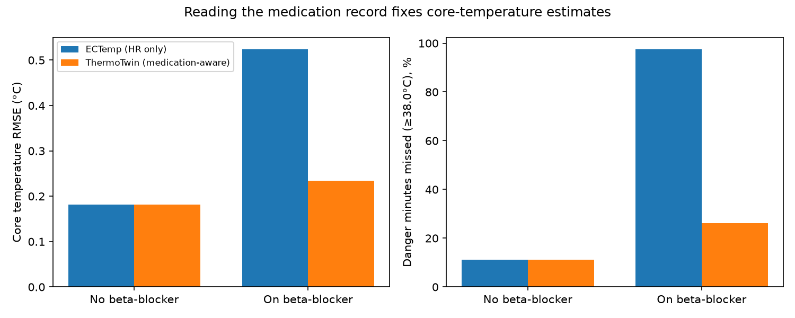

# ThermoTwin

**A medication-aware hypertension digital twin that predicts when India's heat will tip a patient into crisis.**

Built for the Happiest Health *Digital Twin Challenge 2026*.

> Research prototype on synthetic data. Not a medical device.

## The idea in one paragraph

About 315 million Indian adults have hypertension, and millions of them work outdoors through
heatwaves. Their blood-pressure medicines change how their bodies handle heat. Beta-blockers
blunt the heart-rate rise that wearable heat models rely on, so those models under-read core
temperature for exactly these patients. ThermoTwin reads the patient's medication record and
corrects its physiology model before estimating and forecasting heat strain.

## Quickstart

```bash
uv sync
uv run pytest
uv run python -m thermotwin.ablation --patients 60
```

The ablation writes `reports/ablation_summary.csv` and `reports/ablation_beta_blocker.png`.

## Headline result: real heat-trial data (PROSPIE, 22 participants, 99 trials)

**1. ECTemp validation.** On real rectal temperature, our ECTemp gives RMSE **0.32 °C**, in line
with the published ~0.3 °C. Adding skin temperature barely helps (0.31 °C, participant-held-out
CV), so we don't claim it.

**2. Beta-blocker ablation on real data.** Real heart rate and core temperature, with a hidden
beta-blocker response applied to heart rate only:

| Estimator | RMSE | Bias | Danger minutes caught (≥38 °C) | False-alarm rate |
|---|---|---|---|---|
| ECTemp (HR only) | 0.63 °C | −0.48 °C | 18% | 0% |
| **ThermoTwin (medication-aware)** | **0.39 °C** | **−0.20 °C** | **62%** | **8%** |

Reproduce (the data is CC BY-NC 4.0 and not committed):

```bash
uv run python -m thermotwin.prospie --download
uv run python -m thermotwin.fusion
uv run python -m thermotwin.real_ablation
```

Alerts fire when the estimate's upper bound (mean + 1 SD) reaches 38 °C. PROSPIE
participants are healthy volunteers, so the drug effect is simulated. A trial with real
beta-blocker users would be the next validation step.

## 60-minute forecast (real Delhi heatwave weather, May–June 2024)

Question at each minute: *will core temperature reach 38 °C in the next 60 minutes?*
There are 200 simulated workers, each on a real Delhi heatwave day (Open-Meteo, peaks of 46 °C).
We test on 60 patients the model never trained on.

| Method | AUROC | AUPRC | Episodes warned ≥30 min ahead |
|---|---|---|---|
| Weather-only heat alert | 0.62 | 0.35 | 0% |
| Twin nowcast (no ML) | 0.70 | 0.43 | 16% |
| **ThermoTwin 60-min forecast** | **0.70** | **0.42** | **26%** (median lead 44 min) |
| Oracle ceiling (knows true current core) | 0.97 | 0.94 | 63% |

**Honest reading:**
- The twin beats a city-wide weather alert.
- The oracle shows the bottleneck is *estimating current core temperature*, not forecasting.
  On heatwave days workers hover near 37.8 °C (SD 0.23 °C), so the twin's ~0.25 °C
  estimation error is as large as the whole spread.
- Things we tried that did not help:
  - a Gagge physics projection
  - anchoring the start with a thermometer reading
  - thermometer spot readings at each break
- Next step: learn each person's heart-rate offset over time.

```bash
uv run python -m thermotwin.forecast --patients 200
```

## Simulated cohort (60 patients, seed 42)

| Group | Estimator | Core-temp RMSE | Bias | Danger missed | False-alarm minutes |
|---|---|---|---|---|---|
| No beta-blocker | ECTemp / ThermoTwin (identical) | 0.18 °C | +0.01 °C | 6% | 2,576 |
| On beta-blocker | ECTemp (HR only) | 0.52 °C | −0.52 °C | 95% | 0 |
| On beta-blocker | **ThermoTwin** | **0.23 °C** | **−0.04 °C** | **15%** | 3,285 |

The simulator is easier than reality (0.18 °C vs 0.32 °C on real data), so treat the real-data
results above as the headline numbers.



### How the evaluation avoids circularity

- **Ground truth** core and skin temperature come from **JOS-3**, a multi-node
  thermoregulation model (`pythermalcomfort`).
- **Heart rate** is generated by a separate linear model, not ECTemp's quadratic.
- **Each patient's true beta-blocker response is hidden**. The twin only sees the EHR
  medication list and uses population priors.
- The simulated cohort is a sanity check. The real-data PROSPIE results above are the
  primary evidence.

## How it works (so far)

| Module | Role |
|---|---|
| `ectemp.py` | ECTemp extended Kalman filter: core temperature from 1-minute heart rate (Buller et al. 2013) |
| `medication.py` | Drug classes; beta-blocker correction (un-blunt HR with population priors, widen noise) |
| `cohort.py` | Synthetic hypertensive outdoor workers: EHR-visible fields plus hidden physiology |
| `simulator.py` | Minute-by-minute shift: JOS-3 thermoregulation + separate HR model + heatwave day |
| `ablation.py` | Signature comparison on the simulated cohort |
| `prospie.py` | Loader for the real PROSPIE heat-trial dataset |
| `fusion.py` | Participant-held-out ECTemp validation and skin-temperature fusion test |
| `weather.py` | Open-Meteo historical weather (cached), Delhi heatwave 2024 |
| `forecast.py` | 60-minute danger forecast, baselines, oracle ceiling, lead times |
| `real_ablation.py` | Beta-blocker ablation on real heart rate and core temperature |

## Roadmap

- [x] Core-temperature filter, medication correction, ground-truth simulator, ablation
- [ ] Reduce false alarms; no-wearable Tier 0 model (skin fusion tested: negligible gain)
- [x] Real-data validation and beta-blocker ablation on PROSPIE
- [ ] Synthea cohort with a custom beta-blocker module, exported as FHIR
- [x] Real heatwave replay from Open-Meteo historical weather
- [x] 60-minute forecast with baselines and oracle ceiling
- [ ] Per-person heart-rate offset learning (closes the gap to the oracle); conformal intervals
- [ ] Kidney-injury warning, acclimatisation tracking, pre-summer medication review
- [ ] FastAPI service and React clinician dashboard with a what-if simulator
- [ ] Docker Compose, architecture PDF, demo video

## Submission details

- **Team:** _TBD_
- **College / incubator:** _TBD_
- **Video:** _TBD_
- **Architecture diagram / presentation:** _TBD_ (`docs/`)
- **License:** MIT (see `LICENSE`)

## References

- Buller MJ et al. Estimation of human core temperature from sequential heart rate observations. *Physiol Meas* 2013;34(7):781–798.
- Takahashi Y et al. Thermoregulation model JOS-3 with new open source code. *Energy and Buildings* 2021;231:110575.
- Antihypertensive medication and heat-related illness during heatwaves (2026). doi:10.1002/pds.70447
